# 🚀 MEROUANE AMQOR 🚀
## *Technical Lead • Full-Stack Architect • Agile Expert*


---

<!-- HIDDEN EASTER EGG MATRIX -->
<details>
<summary><b>🎮 SECRET MATRIX CODE 🎮</b></summary>
<pre><code>
███╗   ███╗███████╗██████╗  ██████╗ ██╗   ██╗ █████╗ ███╗   ██╗███████╗
████╗ ████║██╔════╝██╔══██╗██╔═══██╗██║   ██║██╔══██╗████╗  ██║██╔════╝
██╔████╔██║█████╗  ██████╔╝██║   ██║██║   ██║███████║██╔██╗ ██║█████╗
██║╚██╔╝██║██╔══╝  ██╔══██╗██║   ██║██║   ██║██╔══██║██║╚██╗██║██╔══╝
██║ ╚═╝ ██║███████╗██║  ██║╚██████╔╝╚██████╔╝██║  ██║██║ ╚████║███████╗
╚═╝     ╚═╝╚══════╝╚═╝  ╚═╝ ╚═════╝  ╚═════╝ ╚═╝  ╚═╝╚═╝  ╚═══╝╚══════╝

>> NEURAL LINK ESTABLISHED <<
>> LOADING COSMIC CONSCIOUSNESS... <<
>> QUANTUM ENTANGLEMENT: ACTIVE <<
</code></pre>
</details>


## 🏆 Professional Profile

| 🏆 Certifications | 👑 Leadership | 💻 Technical | ⚡ Competencies |
|---|---|---|---|
| [-00D4FF?style=flat&logo=scrumalliance&logoColor=white)](#certifications) | [](#leadership) | [](#technologies) | [](#experience) |
| | [](#leadership) | [](#technologies) | [](#achievements) |


---


## 👨‍💻 ━━━━━━ PROFESSIONAL PROFILE ━━━━━━ 👨‍💻


## 👨‍💻 Professional Overview

> **Experienced Technical Lead and Certified ScrumMaster® with a proven track record in leading development teams and delivering scalable solutions.**
>
> Currently leading the development team at **DabaDoc**, where I've successfully managed projects serving **300,000+ monthly active users** and improved system performance by **15%** through strategic optimizations.
>
> **Expert in Agile methodologies, DevOps practices, and cloud-native architectures**, with extensive experience in both frontend and backend technologies.

### 📊 Key Metrics

| Metric | Value | Description |
|--------|-------|-------------|
| **👥 Leadership** | 3+ Years | Technical team management |
| **👥 Scale** | 300K+ Users | Monthly active users served |
| **⚡ Performance** | 15% Improvement | System optimization results |
| **👥 Mentoring** | 8 Developers | Team members guided |

## 🏆 Professional Achievements

| Achievement | Impact | Business Value | Difficulty |
|-------------|--------|----------------|------------|
| 🏥 **Platform Leadership** | 300,000+ Monthly Users | 💰 Revenue Growth Driver | 🔴 Enterprise Scale |
| ⚡ **Performance Excellence** | 15% User Growth | 🚀 System Efficiency | 🟡 Technical Challenge |
| 🚀 **DevOps & Cloud Migration** | 99.95% Uptime | 🔧 Operational Excellence | 🔵 Infrastructure Scale |
| 👥 **Team Leadership** | 8 Developers Mentored | 🎯 Knowledge Transfer | 🟣 People Management |
| 🔒 **Security Standards** | SOC 2 Compliance Ready | 🛡️ Risk Mitigation | 🟠 Regulatory Compliance |


<details>
<summary><strong>🏆 Certifications & Education</strong></summary>

- 🎓 **Master's Degree in Computer Science** - SUPEMIR University (Networks & Multimedia, 2022)
- 🏆 **Certified ScrumMaster® (CSM)** - Scrum Alliance (Certified April 2023)
- 🗣️ **Languages:** French (C1 - Autonomous) | English (B2 - Upper Intermediate)

</details>


---

## 💼 Professional Experience

### 🚀 Career Progression


### 📋 Work Experience

#### 🏥 Technical Lead & ScrumMaster | DabaDoc (Casablanca)
**January 2023 – Present**

**Leadership & Team Management:**
- Led a team of 8 developers in Agile development cycles
- Implemented Scrum methodologies and sprint planning processes
- Mentored junior developers and conducted code reviews
- Coordinated with cross-functional teams for requirement gathering

**Technical Achievements:**
- Optimized platform performance resulting in 15% user growth
- Implemented cloud infrastructure improvements for 99.95% uptime
- Developed and deployed features for 300,000+ monthly active users
- Established CI/CD pipelines and DevOps best practices

**Business Impact:**
- Successfully delivered corporate projects to major Moroccan enterprises
- Managed partnerships with Mawarid Health and Fatourati
- Improved collaboration with corporate clients and stakeholders

---

#### 💻 Senior Full-Stack Developer | DabaDoc (Casablanca)
**April 2022 – January 2023**

**Development Responsibilities:**
- Developed full-stack features for medical appointment platform
- Implemented online booking systems and patient management modules
- Built notification systems and integrated payment solutions
- Enhanced UX/UI with modern frontend frameworks

**Technical Stack:** Ruby on Rails, React.js, Angular, PostgreSQL, AWS
**Key Results:** Features used by 300K+ patients and practitioners monthly

---

#### 🔧 Software Engineer | Majorel (Casablanca)
**May 2020 – April 2022**

**Project Delivery:**
- Developed and customized websites for Solocal (Pages Jaunes) clients
- Delivered dozens of websites for SMEs and PMIs
- Implemented SEO optimization and responsive design
- Collaborated with French development teams

**Technical Skills:** JavaScript, REST APIs, Agile methodologies
**Impact:** Enhanced local team SEO and UX competencies


---

## 🛠️ Technical Expertise

### 💻 Technology Stack Overview

```mermaid
graph LR
    A[Backend<br/>🔴 Ruby/Rails] --> D[Full-Stack<br/>Architecture]
    B[Frontend<br/>🟢 React/Angular] --> D
    C[DevOps<br/>🔵 AWS/K8s] --> D
    D --> E[Healthcare<br/>Platform]
    D --> F[Enterprise<br/>Solutions]

    style A fill:#FF6B6B,stroke:#333,stroke-width:2px
    style B fill:#4ECDC4,stroke:#333,stroke-width:2px
    style C fill:#00D4FF,stroke:#333,stroke-width:2px
    style D fill:#FFE66D,stroke:#333,stroke-width:2px
    style E fill:#FF6B6B,stroke:#333,stroke-width:2px
    style F fill:#4ECDC4,stroke:#333,stroke-width:2px
```



### 🏗️ Core Technologies

| Domain | Technologies | Expertise |
|--------|--------------|-----------|
| **🔴 Backend** | Ruby, Ruby on Rails, Node.js, PHP | RESTful APIs, Microservices, Database Design |
| **🟢 Frontend** | React.js, Angular, AngularJS, TypeScript | Responsive UI/UX, Component Architecture, State Management |
| **🔵 DevOps** | AWS, Docker, Kubernetes, GitHub Actions | Cloud Infrastructure, CI/CD Pipelines, Monitoring |
| **🟡 Database** | PostgreSQL, MongoDB, Redis | Performance Optimization, Data Architecture, Caching |

### 🧪 Testing & Quality

- **Unit Testing & API Testing Automation**
- **Test Coverage Analysis & TDD/BDD**
- **Performance Testing & Load Testing**
- **Code Quality & Security Standards**


---


## 📈 Career Highlights & Metrics

### 🎯 Key Performance Indicators


| Metric | Achievement | Impact |
|--------|-------------|---------|
| 📈 **User Growth** | +15% | Monthly Active Users Increase |
| ⚡ **System Reliability** | 99.95% | Platform Uptime Achieved |
| 👥 **Team Leadership** | 8 Developers | Mentored & Guided |
| 🏢 **Project Delivery** | 100% | On-Time Corporate Projects |


### 🏆 Major Career Milestones

✅ **Technical Leadership Promotion** - Promoted to Technical Lead & ScrumMaster at DabaDoc within 9 months
✅ **Enterprise Scale Achievement** - Successfully scaled platform to 300,000+ monthly active users
✅ **Corporate Partnership Success** - Delivered projects for major Moroccan enterprises (Mawarid Health, Fatourati)
✅ **Performance Optimization Impact** - Achieved 15% user growth through strategic technical improvements

## 🤝 Contact & Networking


| Platform | Purpose | Link |
|----------|---------|------|
| 💼 **LinkedIn** | Professional networking & opportunities | [linkedin.com/in/merouaneamqor](https://linkedin.com/in/merouaneamqor) |
| 💻 **GitHub** | Code repositories & contributions | [github.com/merouaneamqor](https://github.com/merouaneamqor) |
| 📧 **Email** | Collaboration inquiries | [merouane.amqor@example.com](mailto:merouane.amqor@example.com) |


### 🚀 Professional Summary

Experienced Technical Lead and Certified ScrumMaster® with a passion for building scalable, high-performance applications and leading development teams to success.

**Current Focus:** Leading digital transformation initiatives at DabaDoc, mentoring developers, and implementing DevOps best practices for enterprise-scale applications.

**Open to:** Technical leadership roles, senior full-stack positions, and consulting opportunities in Agile development and cloud architecture.


---


## 📊 ━━━━━━ GITHUB ACTIVITY & STATS ━━━━━━ 📊


## 📊 GitHub Activity & Stats


### 📈 Development Activity Overview

<!-- GitHub Stats Table -->
| Stats | Languages | Activity |
|-------|-----------|----------|
|  |  |  |


---


## 🎯 ━━━━━━ CURRENT INITIATIVES & FOCUS ━━━━━━ 🎯


## 🎯 Current Initiatives & Growth

### 📚 Professional Development Focus

| Area | Current Activities | Goals |
|------|-------------------|-------|
| **☁️ Cloud Architecture** | AWS Solutions Architect certification prep | Advanced cloud infrastructure design |
| **🚀 DevOps Excellence** | Kubernetes CKA certification, CI/CD pipelines | Enterprise DevOps transformation |
| **👥 Leadership** | Executive leadership & stakeholder management | Senior technical leadership roles |
| **🏥 Domain Expertise** | Healthcare technology & telemedicine optimization | Specialized healthcare solutions |

### 🏗️ Active Project Initiatives

- **DabaDoc Platform Enhancement** - Leading microservices migration and performance optimization
- **DevOps Infrastructure** - Implementing advanced monitoring and automated deployment pipelines
- **Team Process Improvement** - Agile transformation and developer productivity enhancement
- **Corporate Partnership** - Managing relationships with major healthcare enterprises

### 🎯 Career Growth Objectives

- **Technical Director Path** - Aspiring to senior technical leadership and architecture roles
- **Industry Recognition** - Speaking at tech conferences and contributing to open source
- **Team Expansion** - Building and scaling high-performance development teams
- **Innovation Focus** - Research and development in emerging technologies and methodologies

---

## ✨ Professional Excellence Achieved

```
╔══════════════════════════════════════════════════════════════════════════════════════════════════════════════════════════════╗
║                                                                                                                      ║
║   ███████╗ ██████╗  ██████╗ ██╗   ██╗██╗██╗     ███████╗██████╗  ██████╗ ██╗   ██╗ █████╗ ███╗   ██╗███████╗██████╗    ║
║   ██╔════╝██╔═══██╗██╔═══██╗██║   ██║██║██║     ██╔════╝██╔══██╗██╔═══██╗██║   ██║██╔══██╗████╗  ██║██╔════╝██╔══██╗   ║
║   ███████╗██║   ██║██║   ██║██║   ██║██║██║     █████╗  ██████╔╝██║   ██║██║   ██║███████║██╔██╗ ██║█████╗  ██████╔╝   ║
║   ╚════██║██║   ██║██║   ██║██║   ██║██║██║     ██╔══╝  ██╔══██╗██║   ██║██║   ██║██╔══██║██║╚██╗██║██╔══╝  ██╔══██╗   ║
║   ███████║╚██████╔╝╚██████╔╝╚██████╔╝██║███████╗███████╗██║  ██║╚██████╔╝╚██████╔╝██║  ██║██║ ╚████║███████╗██║  ██║   ║
║   ╚══════╝ ╚═════╝  ╚═════╝  ╚═════╝  ╚══════╝╚══════╝╚══════╝╚═╝  ╚═╝ ╚═════╝  ╚░░░░░░╚═╝  ╚═══╝╚░░░░░░╚═╝  ╚═╝   ║
║                                                                                                                      ║
║              >> TECHNICAL LEADER • FULL-STACK ARCHITECT • AGILE EXPERT <<                                           ║
║                                                                                                                      ║
║  🚀 PROFILE ID: PROFESSIONAL_2025 | VERSION: EXCELLENCE | STATUS: LEADING 🚀                                       ║
║                                                                                                                      ║
╚══════════════════════════════════════════════════════════════════════════════════════════════════════════════════════════════╝
```

### 🎯 Career Status Summary

- **Technical Leadership:** ✅ ACHIEVED
- **Full-Stack Expertise:** ✅ MASTERY
- **Enterprise Architecture:** ✅ ENTERPRISE SCALE
- **Professional Network:** ✅ AUTHENTICATED

### 💭 Leadership Philosophy

> **"Great software isn't just about code—it's about creating solutions that empower people and drive business success.**
>
> **I believe in leading by example, fostering innovation, and building systems that scale both technically and organizationally.**
>
> **Every project is an opportunity to learn, grow, and make a meaningful impact on users and teams alike."**

---


*Built with ❤️ using Markdown, Mermaid diagrams, and a passion for clean, professional documentation*


